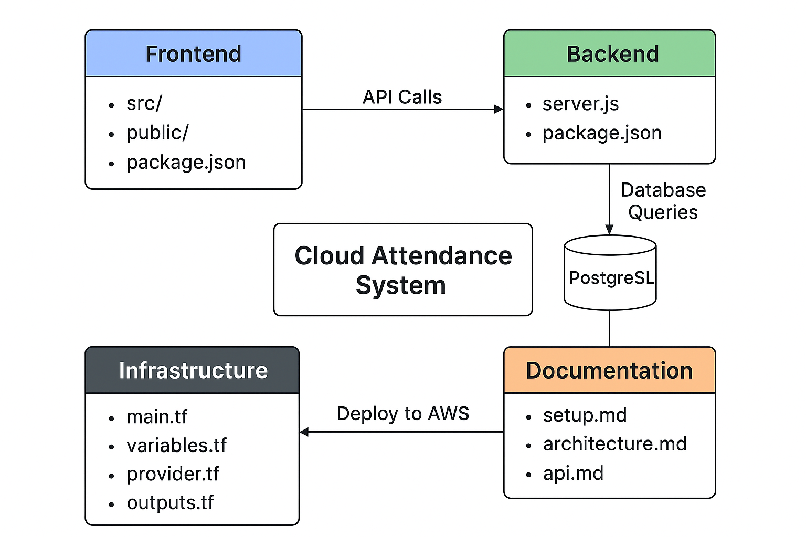

# Cloud-Based Attendance Tracking System
A modern, scalable attendance management solution built with Node.js, React, PostgreSQL, AWS, and Terraform.

## Overview
The Cloud-Based Attendance Tracking System is a comprehensive full-stack application designed for efficient attendance management. This project showcases cloud-native architecture with infrastructure as code, providing a production-ready foundation for scalable attendance tracking.

## Features
- ✅ **Real-time Attendance Tracking** - Capture and monitor attendance in real-time
- ☁️ **Cloud-Based Data Storage** - Secure PostgreSQL database hosted on AWS
- 🚀 **Scalable Architecture** - Built to handle growing user demands
- 🛠️ **Infrastructure as Code** - Automated AWS infrastructure deployment with Terraform
- 🔌 **RESTful API Design** - Clean, well-documented API endpoints
- 💻 **Modern Responsive UI** - React-based frontend with intuitive user experience
- 🔐 **Secure Authentication** - User authentication and authorization
- 📊 **Analytics Dashboard** - Visual insights into attendance patterns

## Tech Stack
- **Backend**: Node.js with Express
- **Frontend**: React
- **Database**: PostgreSQL
- **Cloud Platform**: AWS (EC2, RDS, VPC, Security Groups)
- **Infrastructure as Code**: Terraform

## Project Structure
```
cloud-attendance-system/
├── backend/           # Node.js backend application
│   ├── server.js      # Express server with API endpoints
│   └── package.json   # Backend dependencies
├── frontend/          # React frontend application
│   ├── src/           # React components and application code
│   └── package.json   # Frontend dependencies
├── infra/             # Terraform infrastructure code
│   ├── main.tf        # Main Terraform configuration
│   ├── variables.tf   # Variable definitions
│   ├── outputs.tf     # Output values
│   └── README.md      # Infrastructure documentation
└── docs/              # Project documentation
    └── README.md      # Additional documentation
```


*Project Architecture: Cloud Attendance System—End-to-End Stack and File Structure*

## Getting Started

### Prerequisites
- Node.js (v14 or higher)
- PostgreSQL (v12 or higher)
- AWS Account
- Terraform (v1.0 or higher)

### Installation

1. Clone the repository:
   ```bash
   git clone https://github.com/yourusername/cloud-attendance-system.git
   cd cloud-attendance-system
   ```

2. Install backend dependencies:
   ```bash
   cd backend
   npm install
   ```

3. Install frontend dependencies:
   ```bash
   cd ../frontend
   npm install
   ```

4. Configure environment variables:
   Create `.env` files in both backend and frontend directories (see `.env.example` files)

5. Set up infrastructure:
   ```bash
   cd infra
   terraform init
   terraform plan
   terraform apply
   ```

### Running the Application

1. Start the backend server:
   ```bash
   cd backend
   npm start
   ```

2. Start the frontend development server:
   ```bash
   cd frontend
   npm start
   ```

3. Access the application at `http://localhost:3000`

## Deployment

### Production Build

1. Build the frontend:
   ```bash
   cd frontend
   npm run build
   ```

2. Deploy using Terraform:
   ```bash
   cd infra
   terraform apply
   ```

## Troubleshooting

### Common Issues

#### Database connection errors
- Verify database credentials in `.env` file
- Ensure port 3001 is not already in use

#### Frontend can't connect to backend
- Verify `REACT_APP_API_URL` in frontend `.env` file
- Check that backend is running and accessible
- Review CORS settings in backend server

#### Terraform apply fails
- Verify AWS credentials are configured correctly
- Check that you have necessary AWS permissions
- Review Terraform error messages for specific resource issues

## Contributing
Contributions are welcome! Please:
1. Fork the repository
2. Create a feature branch
3. Make your changes with clear commit messages
4. Submit a pull request

## Future Enhancements
- Mobile application support
- Biometric authentication integration
- Advanced reporting and analytics
- Email/SMS notifications
- Multi-tenant support
- Docker containerization
- CI/CD pipeline with GitHub Actions

## License
MIT License - feel free to use this project for learning and development purposes.

## Support
For issues, questions, or contributions, please open an issue in the GitHub repository.

---
**Note**: This project includes all core starter code necessary for deployment. The backend server skeleton, frontend React app, Terraform infrastructure scripts, and requirements documentation are all in place and ready for development and deployment.
